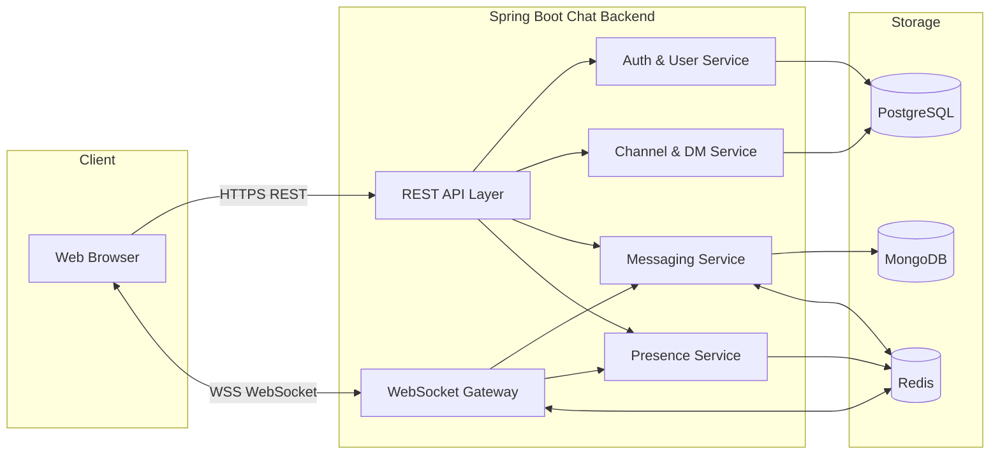

# Architecture & Tech Stack – Slack Clone Backend

## High‑Level Architecture Overview

The system will start as a **modular monolith** built with Spring Boot (JDK 21) exposing:

- REST APIs for authentication, user/channel/DM management, and message history.
- WebSocket endpoints for real‑time messaging and presence updates.

### Core Components

- **Web Client (Browser – React SPA)**
  - React + TypeScript single-page application built with Vite.
  - Uses React Router for client-side routing (login, main app shell, settings later).
  - Uses React Query (TanStack Query) for server state (auth user, channels, DMs, message history, presence snapshots).
  - Maintains a WebSocket client to the backend for real-time messages and presence updates.
  - Handles login, channel/DM navigation, message display, and basic presence indicators in a Slack-like layout (sidebar + main chat area).

- **API & WebSocket Gateway (Spring Boot App)**
  - Exposes REST endpoints under `/api/...`.
  - Exposes WebSocket endpoint (e.g., `/ws`) for chat and presence.
  - Stateless in terms of HTTP requests (JWT auth, no server‑side sessions).
  - Maintains in‑memory WebSocket sessions per node; coordinates via Redis/pub‑sub when scaled horizontally.

- **PostgreSQL (Relational DB)**
  - Stores users, channel metadata, memberships, DM conversation metadata, and presence snapshot if needed.

- **MongoDB (Document Store)**
  - Stores all chat messages (channel messages, DM messages) as documents.
  - Optimized for high write throughput and append‑only usage with time‑based queries.

- **Redis (Optional but Recommended)**
  - Caching layer for frequently accessed data (user profiles, presence).
  - Pub/sub bus for broadcasting messages/presence events across multiple app instances.

### High‑Level Diagram

### Request/Message Flows (Conceptual)

1. **User Registration/Login**
   - Client → REST API (Auth Service) → PostgreSQL for user records.
   - On successful login, JWT token is returned; client uses it for all subsequent REST/WebSocket calls.

2. **Channel/DM Management**
   - Client → REST API (Channel & DM Service) → PostgreSQL for channel, membership, DM conversation metadata.
   - APIs secured via JWT.

3. **Message Send (Channel or DM)**
   - Client sends message either via:
     - REST API call to Messaging Service; or
     - WebSocket message to WebSocket Gateway.
   - Backend validates auth, resolves channel/DM, and persists the message to MongoDB.
   - Backend publishes an event to Redis (if multiple instances) and sends real‑time messages to all relevant WebSocket subscribers.

4. **Message History Read**
   - Client → REST API (Messaging Service) → MongoDB query with filters (channelId or conversationId, pagination, order by createdAt).

5. **Presence**
   - On WebSocket connect/disconnect, Presence Service updates in‑memory + Redis state.
   - Optionally writes periodic snapshots to PostgreSQL for backup.
   - Presence updates are broadcast over WebSockets and/or accessible via REST.

## Architectural Style

- **Modular Monolith** for backend service:
  - Single deployable Spring Boot application.
  - Implemented as a **multi-module Gradle project** with one module per core domain/cross-cutting concern.
  - Clear boundaries and interfaces so that, in the future, each module could be extracted into a microservice if needed.

- **Stateful connections for WebSockets**, but logically **stateless scaling**:
  - Each node tracks its own WebSocket sessions in memory.
  - Redis pub/sub is used to fan‑out messages/presence events across nodes.

### Suggested Gradle Modules (Multi-Module Monolith)

To keep things simple but still modular, the backend can be structured as a **small set** of Gradle modules:

- `app` (or `bootstrap`)
  - Spring Boot main application.
  - Hosts the REST and WebSocket endpoints.
  - Depends on the other modules.

- `identity-module`
  - Combines **auth + user + security** concerns.
  - Registration, login, password hashing.
  - JWT generation/validation and Spring Security configuration (filters, config classes).
  - User profile management and `users` JPA entity/repository.

- `chat-module`
  - Core chat domain: channels, memberships, DM conversations, messaging, and presence.
  - Owns Postgres entities (`channels`, `channel_members`, `dm_conversations`, optional `user_presence`).
  - Owns MongoDB message documents and repositories.
  - Implements channel/DM/message/presence services used by `app`.

- `shared-module`
  - Shared domain primitives (IDs, value objects), base exceptions, and utilities.
  - Cross-cutting config for observability (logging/metrics/tracing) and infrastructure wiring (Postgres/Mongo/Redis beans).

This layout reduces the number of modules while still making clear separation between **identity**, **chat domain**, and **shared infra/cross-cutting** concerns. The deployable artifact remains a single Spring Boot app.

## Tech Stack Choices

### Backend
- **Language**: Java, JDK 21.
- **Framework**: Spring Boot (latest compatible with JDK 21).
- **Key Spring modules**:
  - Spring Web (REST APIs).
  - Spring WebSocket + STOMP (or raw WebSocket) for real‑time messaging.
  - Spring Data JPA for PostgreSQL.
  - Spring Data MongoDB for Mongo.
  - Spring Security for JWT‑based authentication.
  - (Optional) Spring Cache for Redis‑backed caching.

### Databases
- **PostgreSQL**
  - Rationale: strong relational features, good for transactional data (users, channels, memberships, DM conversation metadata), robust indexing.

- **MongoDB**
  - Rationale: flexible schema for messages, efficient for large volumes of append‑only data and time‑based queries.
  - Good fit for storing JSON message payloads that might evolve.

### Caching & Messaging
- **Redis** (optional but recommended even in POC):
  - As a cache for hot user/channel/presence data.
  - As a pub/sub bus to coordinate message broadcasts across multiple backend instances.

### Infrastructure & Deployment (v1)

- **Containerization**:
  - Docker images for:
    - Spring Boot app.
    - Postgres.
    - MongoDB.
    - Redis.

- **Local Orchestration**:
  - docker‑compose for running the full stack locally.

- **Cloud‑Ready**:
  - Design suitable for deployment behind a cloud load balancer.
  - Stateless app containers, environment‑based configuration.
  - DBs replaced by managed services in the cloud (e.g., RDS for Postgres, Atlas/managed Mongo, managed Redis).

## Alternative Architectures (For Learning)

- **Microservices**: Split into independent services (auth, channels, messaging, presence) communicating via REST/gRPC and events. Rejected for v1 due to added complexity; modular monolith is easier to implement and reason about.

- **Single DB Only**: Use only Postgres or only Mongo. Rejected because the goal is to learn **polyglot persistence** and trade‑offs between relational and document stores.

The chosen architecture keeps implementation manageable while surfacing important system design concepts: real‑time updates, polyglot persistence, horizontal scaling, caching, and observability.